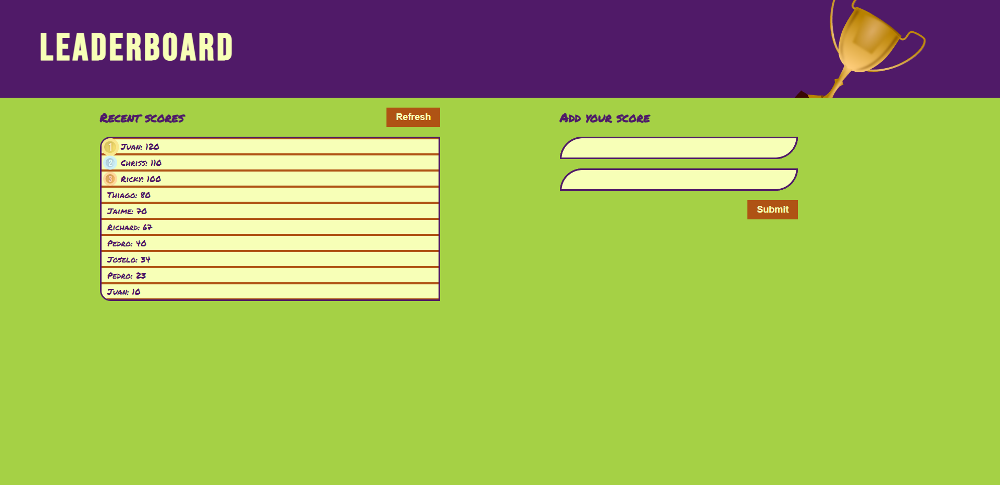

# Lederboard



The leaderboard website displays scores submitted by different players. It also allows you to submit your score. All data is preserved thanks to the external API

## Getting Started

### Setup


to set it up yo have to first run 

```
npm install
```

after that you can run the local development server with:
```
npm start
```

## Built With

- HTML
- CSS
- JavaScript
- Webpack

## Author

👤 **Juan Luis Palacios**

- GitHub: [@JuanLPalacios](https://github.com/JuanLPalacios)
- Twitter: [@JuanLuisPalac20](https://twitter.com/twitterhandle)
- LinkedIn: [LinkedIn](https://www.linkedin.com/in/juan-luis-palacios-p%C3%A9rez-95b39a228/)


## 🤝 Contributing

Contributions, issues, and feature requests are welcome!

Feel free to check the [issues page](../../issues/).

## Show your support

Give a ⭐️ if you like this project!

## Acknowledgments

- [microverse](http://www.microverse.org) for the config templates
- [Attribute Little Robot Sound Factory](www.littlerobotsoundfactory.com), for the sounds

## 📝 License

This project is [MIT](./MIT.md) licensed.